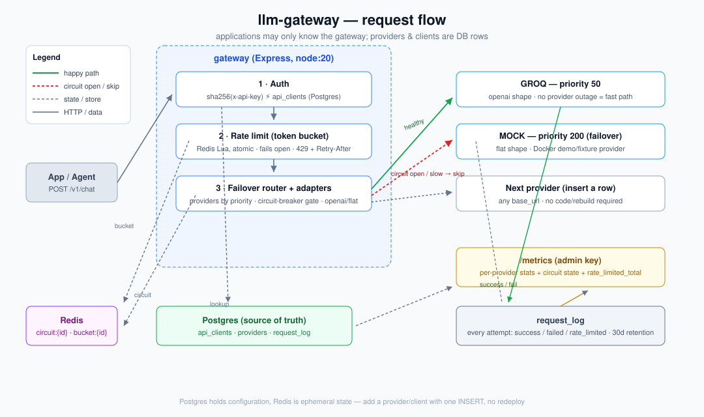

# llm-gateway

[](https://github.com/Atharva6153-git/LLM-Gateway/actions/workflows/ci.yml)

AI Request Gateway — **one API in front of multiple LLM providers** with
circuit-breaker failover and per-client token-bucket rate limiting. Providers
and clients are **DB rows**, so swapping providers or adding traffic limits
needs no code change or redeploy. See `docs/prd-llm-gateway.md` for the full
spec and open decisions.

## Architecture



**Request lifecycle:** `POST /v1/chat` → auth (`sha256` of `x-api-key` vs
`api_clients`) → Redis token-bucket rate limit → failover router (providers by
`priority`, most-preferred first, each gated by a Redis circuit breaker)
→ per-provider adapter (`flat`/`openai` body shapes) → `request_log` row →
normalized `{provider, latency_ms, response}`.

## Facts & defaults (what you'll be quizzed on)

- Auth: `api_clients.api_key_hash` = sha256 hex of the raw key. 401 on miss.
- Rate limit: token bucket in redis `bucket:{id}`, capacity/refill *per client
  row*. 429 + `Retry-After: 1` on empty. **Fails open** unless
  `RATE_LIMIT_FAIL_OPEN=false` → then 503 on Redis outage (fail closed).
- Circuit breaker: `3 failures / 30s window` → open for `60s cooldown` →
  `half_open` admits exactly one trial (`hsetnx`), success resets the circuit.
  Redis `circuit:{id}`. Tuning read from env at boot.
- Failover: providers ordered by `priority` ascending; on `ALL_FAILED` → 503.
  Measured here: mock ~16 ms, Groq ~300–370 ms per call; each healthy
  provider is tried exactly once per request.
- Secrets: only hashes stored; raw keys never logged; `.dockerignore` keeps
  env files out of image layers; admin endpoints require `x-admin-key`
  (constant-time compare).
- Metrics: `/metrics` (admin) = per-provider success/failure + avg latency +
  circuit state + `rate_limited_total`. Retention prunes `request_log` after
  30 days.
- Security posture: nosniff / frame-deny / no-store headers, auth
  brute-force lockout (5 strikes / 60 s per IP), `max_tokens` clamped,
  non-root container (`USER node`), healthchecked compose.

## Run locally

```
cp .env.example .env.docker
docker compose up --build
```

> Env files: Docker (`docker compose up`) uses `.env.docker` (service names
> postgres/redis); `npm run dev` on the host uses localhost in `.env.local`.
> `.dockerignore` excludes env files from image builds.

Starts: postgres (auto-runs init migrations), redis, mock-provider (fake LLM
for failover demo), gateway on :3000.

## Create a test client

```sql
INSERT INTO api_clients (name, api_key_hash, bucket_size, refill_rate)
VALUES ('test-client', encode(digest('test123', 'sha256'), 'hex'), 20, 5);
```

## Try it

```
curl -X POST localhost:3000/v1/chat \
  -H "x-api-key: test123" \
  -H "Content-Type: application/json" \
  -d '{"prompt": "hello"}'
```

## Demo the failover

```
curl -X POST localhost:4000/simulate-fail -d '{"failing": true}' -H "Content-Type: application/json"
```

Hit `/v1/chat` 3+ times — circuit opens on the `mock` provider, traffic moves
on; with only one provider you'll see `503 all providers unavailable`. Check
`/metrics` (requires `x-admin-key` — set `ADMIN_API_KEY`).

## Deploying

- **Render:** copy `render.yaml` (blueprint) → create Postgres service, plug
  its URL into `DATABASE_URL`, provide `REDIS_URL`, set `GROQ_API_KEY` /
  `ADMIN_API_KEY`, push. Set `SEED_CLIENT_KEY` to a raw API key and the
  gateway inserts that client on first boot — no SQL console needed. 
  ```bash
  # Railway (services + volumes for postgres/redis)
  railpack up   # or create a Blueprint from render.yaml
  # Fly.io with the deploy Dockerfile
  fly launch --no-deploy && fly secrets set DATABASE_URL=... REDIS_URL=...
  ```
  TLS is terminated at the platform; the app is plain HTTP behind it.
- Apply migrations to an *existing* DB with `npm run migrate`; fresh
  platforms run them automatically.
- For prod consider `RATE_LIMIT_FAIL_OPEN=false` (reject 503s instead of
  unmetered traffic during a Redis outage).
- Replace or lock down the seeded `test123` client and the default
  `ADMIN_API_KEY` before exposing publicly.
- Quality gates: `npm run lint`, `npm test`, `npm audit` (all in CI).